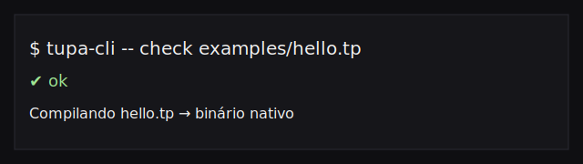

# ⚡ Tupã

[](LICENSE)
[](docs/ROADMAP.md)
[](https://github.com/marciopaiva/tupalang/wiki)
[](https://github.com/marciopaiva/tupalang/actions/workflows/ci.yml)
[](https://github.com/marciopaiva/tupalang/releases)
[](https://www.rust-lang.org/)
[](https://github.com/marciopaiva/tupalang)

Links rápidos: [Guia rápido](docs/GETTING_STARTED.md) · [SPEC](docs/SPEC.md)

**Changelog**: [docs/CHANGELOG.md](docs/CHANGELOG.md)

## 🔎 Índice rápido

- [Status](#-status)
- [Recursos](#-recursos)
- [Roadmap](#-roadmap)
- [CLI](#-cli-dev)

## ✅ Status

- [x] Lexer, parser, typechecker e CLI básicos
- [x] Saída JSON no CLI
- [ ] Codegen funcional (além de stub)
- [ ] Language Server

## ❓ FAQ rápido

- **Já está pronto para produção?** Não, ainda está em implementação.
- **Onde começo?** Veja [docs/GETTING_STARTED.md](docs/GETTING_STARTED.md).
- **Como contribuir?** Leia [CONTRIBUTING.md](CONTRIBUTING.md).

## 🧭 Arquitetura em 1 minuto

- `tupa-lexer` → tokens
- `tupa-parser` → AST
- `tupa-typecheck` → tipos e constraints

## ⚡ Quick Start

```bash
cargo run -p tupa-cli -- parse examples/hello.tp
cargo run -p tupa-cli -- check examples/hello.tp
```

```tupa
// IA responsável desde o primeiro caractere
fn summarize(article: Text) -> SafeText<!misinformation> {
  return llm.generate(f"Resuma objetivamente: {article}")
}
```

## ▶️ Como rodar localmente

```bash
git clone https://github.com/marciopaiva/tupalang.git
cd tupalang
cargo test

# parse
cargo run -p tupa-cli -- parse examples/hello.tp

# check
cargo run -p tupa-cli -- check examples/hello.tp

# lex
cargo run -p tupa-cli -- lex examples/hello.tp
```

```tupa
// Inferência de tipos com tipagem explícita opcional
let idade = 28           // i64 (inferido)
let nome: string = "Ana" // string (explícito)

// Tipos de função (first-class)
let add: fn(i64, i64) -> i64 = soma

// Pattern matching elegante
match http_status {
  200 => print("OK"),
  404 => print("Não encontrado"),
  code if code >= 500 => print(f"Erro servidor: {code}"),
  _ => print("Outro status")
}

// Concorrência leve com segurança garantida
spawn async fn worker(id: i64) {
  let data = await db.query(id)
  process(data)  // Zero data races pelo sistema de tipos
}
```

✅ Familiar para devs Python/JS  
✅ Seguro como Rust  
✅ Rápido como C

---

## 🚀 Caso de Uso: Microserviço de Detecção de Fraude

```tupa
// fraud_detector.tp
@differentiable
fn risk_score(tx: Transaction) -> f64 {
  let neural = fraud_net.infer(tx.features)  // Tensor<f16, density=0.15>
  let symbolic = if tx.country == "BR" && tx.amount > 1000 { 0.8 } else { 0.2 }
  return 0.7 * neural + 0.3 * symbolic  // Fusão neurosimbólica nativa
}

@service(port=8080)
fn main() {
  route.post("/predict", |req: Request| {
    // Safe<f64, !nan> garante que score nunca é NaN (crítico para produção)
    let score: Safe<f64, !nan> = risk_score(req.transaction)
    return Response::json(score)
  })
}
```

**Resultados esperados** (vs Python + PyTorch):

| Métrica | Python | Tupã | Ganho |
| ------- | ------ | ---- | ----- |
| Latência P99 | 45 ms | 8 ms | **5.6x mais rápido** |
| Consumo energia | 100% | 12% | **88% menos carbono** |
| Vazamento dados | Possível (runtime) | Impossível (compile-time) | **Segurança formal** |

---

## 🚀 Próximos 30 dias (ajude agora!)

| Tarefa | Arquivo | Dificuldade |
| ------ | ------- | ----------- |
| Diagnósticos com span/linha/coluna (spec + implementação) | `docs/SPEC.md` | ⭐⭐ |
| Evoluir typechecker (retorno, match, loops, tipos de função) | `crates/tupa-typecheck/` | ⭐⭐⭐ |
| Protótipo de codegen MVP (LLVM) | `crates/tupa-codegen/` | ⭐⭐⭐⭐ |
| Expandir exemplos reais + edge cases | `examples/` | ⭐ |

👉 **Comece aqui**: Abra uma issue com `[RFC]` no título para propor mudanças na spec.

---

## 🧭 Roadmap

- [docs/MVP_PLAN.md](docs/MVP_PLAN.md)
- [docs/ADOPTION_PLAN.md](docs/ADOPTION_PLAN.md)

## 🌍 Orgulho Brasileiro, Ambição Global

Tupã é a **primeira linguagem brasileira com ambição global desde Lua** (1993). Mas enquanto Lua focou em *embeddability*, Tupã nasce para resolver os maiores desafios da computação moderna:

- 🇧🇷 **Raízes tupi-guarani**: nome, logo e filosofia inspirados na sabedoria ancestral
- 🌱 **Sustentabilidade**: esparsidade nativa reduz pegada de carbono da IA
- 🛡️ **Segurança ética**: alignment não é *feature*, é fundação
- ⚡ **Performance**: LLVM + zero-cost abstractions = código tão rápido quanto C

> *"Não estamos reinventando a roda. Estamos construindo a primeira roda que não polui o planeta enquanto rola."*

---

## 📚 Recursos

### Para usuários

- [docs/GETTING_STARTED.md](docs/GETTING_STARTED.md)
- [examples/README.md](examples/README.md)
- [docs/SPEC.md](docs/SPEC.md)
- [docs/GLOSSARY.md](docs/GLOSSARY.md)
- [docs/FAQ.md](docs/FAQ.md)
- [docs/ROADMAP.md](docs/ROADMAP.md)
- [docs/README.md](docs/README.md) (mapa completo)
- [Wiki](https://github.com/marciopaiva/tupalang/wiki)

### Para contribuidores

- [CONTRIBUTING.md](CONTRIBUTING.md)
- [CODE_OF_CONDUCT.md](CODE_OF_CONDUCT.md)
- [docs/DEV_ENV.md](docs/DEV_ENV.md)
- [docs/DIAGNOSTICS_CHECKLIST.md](docs/DIAGNOSTICS_CHECKLIST.md)
- [docs/DIAGNOSTICS_GLOSSARY.md](docs/DIAGNOSTICS_GLOSSARY.md)
- [docs/TESTING.md](docs/TESTING.md)
- [docs/ERROR_MESSAGES.md](docs/ERROR_MESSAGES.md)
- [docs/ARCHITECTURE.md](docs/ARCHITECTURE.md)
- [docs/STYLE_GUIDE.md](docs/STYLE_GUIDE.md)
- [docs/DOCS_CONTRIBUTING.md](docs/DOCS_CONTRIBUTING.md)
- [docs/CI_GUIDE.md](docs/CI_GUIDE.md)
- [docs/GOVERNANCE.md](docs/GOVERNANCE.md)
- [docs/CONTRIBUTING_FAQ.md](docs/CONTRIBUTING_FAQ.md)
- [docs/ISSUES_GUIDE.md](docs/ISSUES_GUIDE.md)

### Internals e planejamento

- [docs/CODEGEN.md](docs/CODEGEN.md)
- [docs/MVP_PLAN.md](docs/MVP_PLAN.md)
- [docs/ADOPTION_PLAN.md](docs/ADOPTION_PLAN.md)
- [docs/DESIGN_NOTES.md](docs/DESIGN_NOTES.md)
- [docs/CHANGELOG.md](docs/CHANGELOG.md)
- [docs/RELEASE_CHECKLIST.md](docs/RELEASE_CHECKLIST.md)
- [docs/RELEASE_GUIDE.md](docs/RELEASE_GUIDE.md)
- [docs/VERSIONING.md](docs/VERSIONING.md)

## 🧩 Contributing quick checklist

- [ ] Abra uma issue (ou `[RFC]` para mudanças grandes)
- [ ] Rode `cargo test`
- [ ] Atualize docs relevantes

---

## 🧰 CLI (dev)

Demo: 

```bash
# lex e imprime tokens
cargo run -p tupa-cli -- lex examples/hello.tp

# lex com saída JSON
cargo run -p tupa-cli -- lex --format json examples/hello.tp

# parse e imprime AST
cargo run -p tupa-cli -- parse examples/hello.tp

# parse e imprime AST em JSON
cargo run -p tupa-cli -- parse --format json examples/hello.tp

# parse via stdin
cat examples/hello.tp | cargo run -p tupa-cli -- parse --stdin

# lex via stdin
cat examples/hello.tp | cargo run -p tupa-cli -- lex --stdin

# parse e valida tipos
cargo run -p tupa-cli -- check examples/hello.tp

# valida tipos com saída JSON
cargo run -p tupa-cli -- check --format json examples/hello.tp

# valida via stdin
cat examples/hello.tp | cargo run -p tupa-cli -- check --stdin

# gera codegen (stub)
cargo run -p tupa-cli -- codegen examples/hello.tp

# gera codegen (stub) em JSON
cargo run -p tupa-cli -- codegen --format json examples/hello.tp

# versão e sobre
cargo run -p tupa-cli -- version
cargo run -p tupa-cli -- about
```

---

## 🧩 Diagnósticos (exemplo)

Erros agora incluem código e linha/coluna:

```text
error[E2001]: type mismatch: expected I64, got Bool
  --> examples/invalid_type.tp:2:15
   |
 2 |   let x: i64 = true;
   |               ^^^^
```

Saída JSON também está disponível via `--format json` para consumo por ferramentas.

---

## ⚖️ Licença

- **Compilador**: Apache License 2.0
- **Runtime**: MIT License
- **Especificação**: CC-BY-SA 4.0

> ✅ Software livre, comercialmente amigável, com compartilhamento obrigatório de melhorias na spec

---

## 🤝 Contribuidores

Em breve.

---

## 🛡️ Security

Veja a política em [docs/SECURITY.md](docs/SECURITY.md).

---

## 💚 Sponsors

Em breve.

---

## 🧪 Matriz de suporte

| Sistema | Status |
| ------- | ------ |
| Linux | ✅ |
| macOS | ✅ |
| Windows (WSL) | ✅ |

---

## 💬 Comunidade

- [GitHub Issues](https://github.com/marciopaiva/tupalang/issues): bugs e melhorias
- [Twitter @tupalang](https://twitter.com/tupalang): atualizações e demos

---

> **🌩️ Tupã: onde a sabedoria ancestral encontra a engenharia do futuro**  
> *[github.com/marciopaiva/tupalang](https://github.com/marciopaiva/tupalang)*
