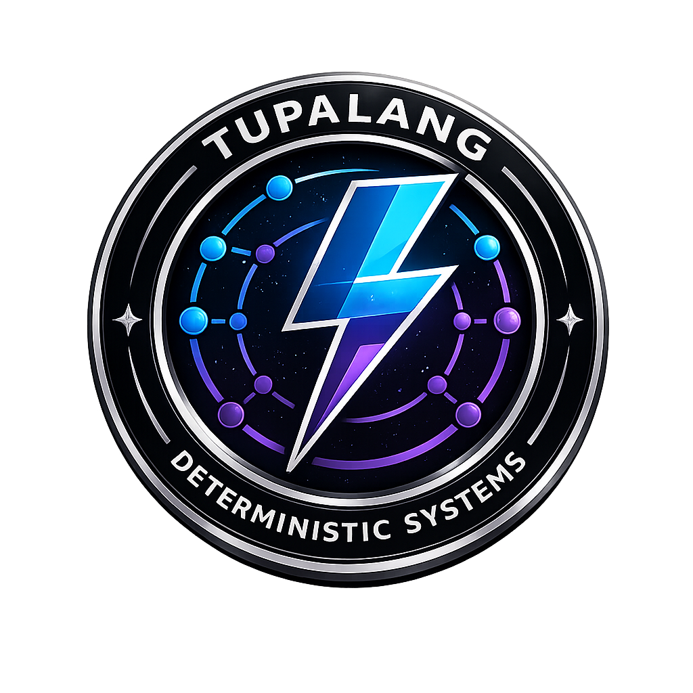

# TupaLang

<!-- markdownlint-disable MD033 -->
<p align="center">
  
</p>

<h1 align="center">TupaLang</h1>

<p align="center"><strong>A typed policy language for auditable runtime decisions.</strong></p>

<p align="center">Deterministic pipelines, static validation, embeddable Rust crates, and applied runtime usage in ViperTrade.</p>

<p align="center">
  <a href="https://github.com/marciopaiva/tupalang/actions/workflows/ci.yml"></a>
  <a href="docs/en/releases/changelog.md"></a>
  
  
  
</p>

<p align="center">
  <a href="docs/en/index.md">Docs</a> •
  <a href="docs/en/guides/installation.md">Install</a> •
  <a href="docs/en/reference/spec.md">Spec</a> •
  <a href="https://github.com/marciopaiva/vipertrade">ViperTrade</a>
</p>
<!-- markdownlint-enable MD033 -->

---

TupaLang is a deterministic, type-safe pipeline language for systems that need auditable policy execution. It is designed for runtime decision flows where static validation, explainability, and predictable behavior matter more than ad hoc scripting.

The project ships as both:

- a standalone CLI for operators and developers
- a set of Rust crates for embedding in real systems

TupaLang is not just a language prototype. It is already used as the applied strategy-policy layer in [ViperTrade](https://github.com/marciopaiva/vipertrade).

## Why TupaLang

Many runtime policy systems become fragile because:

- business logic is mixed into operational code
- validation only happens at runtime
- decision paths are hard to explain after the fact
- rollout discipline breaks under production pressure

TupaLang exists to give these systems:

- typed policy definitions
- deterministic pipeline execution
- static validation before deployment
- structured reasoning and explainable outputs
- a cleaner split between policy and host runtime state

## What It Is Good For

TupaLang is a strong fit for:

- trading strategy policy
- risk and guard pipelines
- AI inference orchestration
- validation and scoring flows
- high-reliability decision services

## Applied Usage In ViperTrade

ViperTrade uses TupaLang as a real strategy layer, not as a toy integration.

In that architecture, TupaLang is responsible for:

- expressing typed policy contracts
- validating the runtime plan before startup
- keeping strategy semantics reviewable and explainable

The Rust host runtime remains responsible for:

- live market state
- exchange execution
- persistence
- temporal state and operational controls

That split is the main practical idea behind TupaLang today.

## Quickstart

Install the latest release binary:

```bash
curl -L https://github.com/marciopaiva/tupalang/releases/latest/download/tupa-linux-x86_64 -o /usr/local/bin/tupa
chmod +x /usr/local/bin/tupa
```

Check the CLI:

```bash
tupa --help
```

Run a pipeline:

```bash
tupa codegen --format=json examples/pipeline/fraud_complete.tp
tupa run --pipeline=FraudDetection --input examples/pipeline/tx.json examples/pipeline/fraud_complete.tp
```

## Language Example

```tupa
enum MarketSignal {}

fn score(input: MarketSignal): i64 {
  return 42;
}

pipeline Strategy @deterministic(seed=42) {
  input: MarketSignal,
  steps: [
    step("score") { score(input) },
  ],
}
```

## Distribution Model

TupaLang follows a hybrid distribution model:

- primary
  - standalone release binaries for direct usage
- secondary
  - published Rust crates for embedders

See:

- [Hybrid Distribution Decision](docs/en/governance/hybrid_distribution_decision.md)
- [Installation Guide](docs/en/guides/installation.md)
- [Embedding in Rust](docs/en/reference/embedding.md)

## Crates

Core crates for embedding:

- `tupa-parser`
- `tupa-typecheck`
- `tupa-runtime`

Supporting published crates:

- `tupa-audit`
- `tupa-cli`
- `tupa-codegen`
- `tupa-effects`
- `tupa-fmt`
- `tupa-lexer`
- `tupa-lint`
- `tupa-pyffi`

`Cargo.toml` example:

```toml
[dependencies]
tupa-parser = "0.8"
tupa-typecheck = "0.8"
tupa-runtime = "0.8"
```

Crate-specific docs:

- [`tupa-audit`](crates/tupa-audit/README.md)
- [`tupa-cli`](crates/tupa-cli/README.md)
- [`tupa-codegen`](crates/tupa-codegen/README.md)
- [`tupa-effects`](crates/tupa-effects/README.md)
- [`tupa-fmt`](crates/tupa-fmt/README.md)
- [`tupa-lexer`](crates/tupa-lexer/README.md)
- [`tupa-lint`](crates/tupa-lint/README.md)
- [`tupa-parser`](crates/tupa-parser/README.md)
- [`tupa-pyffi`](crates/tupa-pyffi/README.md)
- [`tupa-runtime`](crates/tupa-runtime/README.md)
- [`tupa-typecheck`](crates/tupa-typecheck/README.md)

## Installation Paths

Recommended for users:

- release binary from GitHub Releases

Recommended for Rust developers:

```bash
cargo install --locked tupa-cli
```

## Documentation

Start here:

- [Documentation Index](docs/en/index.md)
- [Getting Started](docs/en/guides/getting_started.md)
- [Installation Guide](docs/en/guides/installation.md)
- [Embedding in Rust](docs/en/reference/embedding.md)
- [Language Specification](docs/en/reference/spec.md)
- [Changelog](docs/en/releases/changelog.md)

## Local CI

```bash
./scripts/ci-local.sh
```

Strict links mode:

```bash
CI_LOCAL_STRICT_LINKS=1 ./scripts/ci-local.sh
```

Containerized local CI:

```bash
./scripts/ci-local-container.sh
```

Or through `make`:

```bash
make ci-local-container
```

## Status

TupaLang is in active development as a typed policy language with applied usage in live-adjacent systems. The current line focuses on deterministic execution, strategy/risk policy, embeddability, and clearer runtime contracts.

## License

MIT. See [LICENSE](LICENSE).
