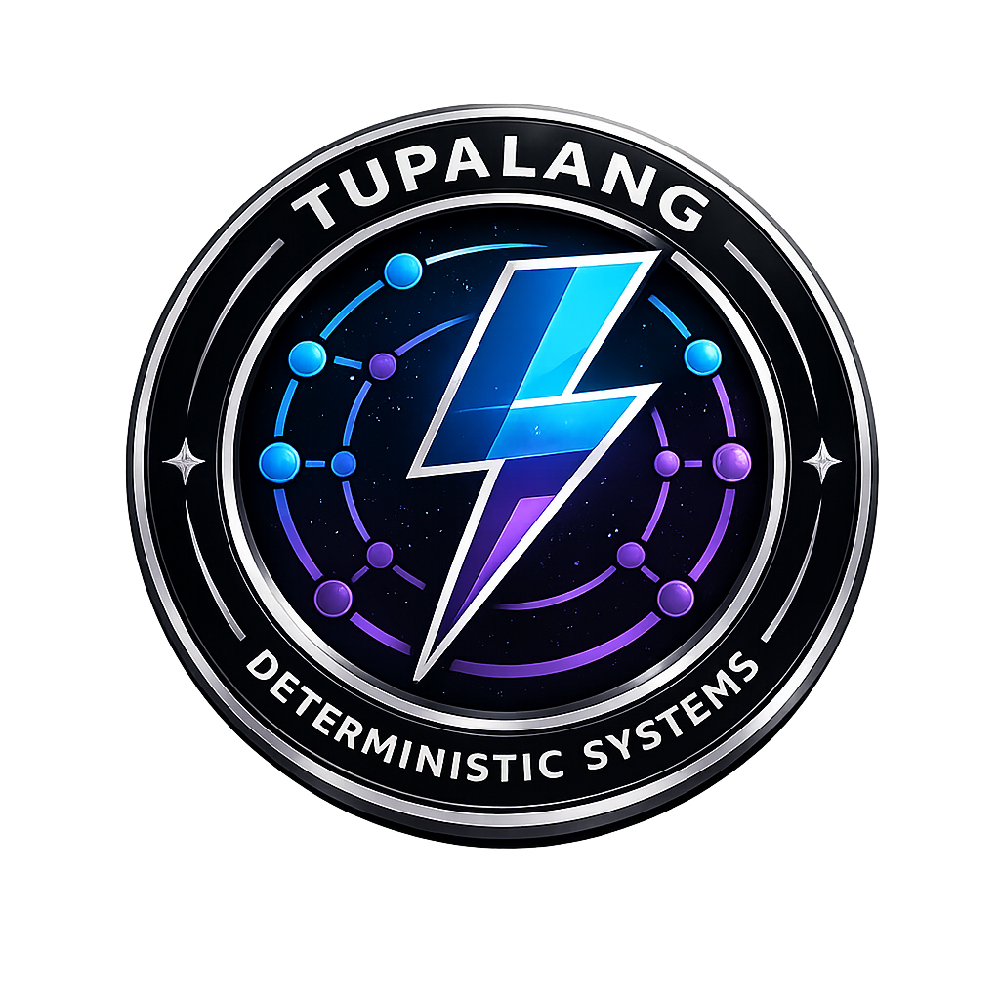

# Tupã: Typed Policy & Strategy DSL for Rust

<p align="center">
  
</p>

<p align="center">
  <strong>Deterministic, type-safe policy pipelines as Rust crates.</strong><br>
  Build auditable trading, risk, and AI decision flows with compile-time guarantees.
</p>

<p align="center">
  <a href="https://github.com/marciopaiva/tupalang/actions"></a>
    <a href="docs/en/releases/changelog.md"></a>
  <a href="https://crates.io/crates/tupa-core"></a>
  <a href="https://rust-lang.org"></a>
  <a href="https://github.com/marciopaiva/vipertrade"></a>
</p>

<p align="center">
  <a href="docs/en/index.md">Documentation</a> •
  <a href="docs/en/guides/getting_started.md">Quick Start</a> •
  <a href="https://crates.io/crates/tupa-core">crates.io</a> •
  <a href="docs/en/PROPOSAL.md">Architecture</a>
</p>

---

## What Is Tupã?

Tupã is a **set of Rust crates** that provide a typed, deterministic DSL for expressing policy and strategy pipelines. It gives you:

- **Static validation** — constraints proven at compile time (no runtime surprises)
- **Type-safe dataflow** — Rust's borrow checker ensures no data races
- **Explainable decisions** — every step is auditable and traceable
- **Embedded, not external** — no separate toolchain; `cargo add tupa-core` is enough

Tupã is designed for domains where correctness matters:

- **Trading & risk** — position limits, drawdown caps, regulatory checks
- **AI inference orchestration** — model selection, safety guards, gradient tracking
- **Critical decision services** — fraud detection, compliance, approval workflows

It is **not** a general-purpose programming language. It is a **policy layer** that lives inside your Rust application.

---

## Quick Example

```rust
use tupa_core::{pipeline, step, constraint, metric};

#[derive(Debug, Clone)]
struct Trade {
    symbol: String,
    side: Side,
    size: f64,
    price: f64,
}

#[derive(Debug, Clone)]
enum Side { Buy, Sell }

fn risk_score(trade: &Trade) -> f64 {
    // ... complex logic
    trade.size * trade.price / 1_000_000.0
}

pipeline! {
    name: PreTradeCheck,
    input: Trade,
    steps: [
        step("risk") { risk_score(input) },
        step("limit") { input.size <= 1_000_000.0 }
    ],
    constraints: [
        metric("max_position").le(10_000_000.0),
        metric("max_leverage").le(2.0)
    ]
}

fn main() {
    let pipeline = PreTradeCheck::new();
    let engine = tupa_engine::Executor::new();
    let trade = Trade { symbol: "AAPL".into(), side: Side::Buy, size: 500_000.0, price: 170.0 };
    let res = engine.run(pipeline, &trade).unwrap();
    println!("Risk score: {}", res.values["risk"]);
}
```

**Result:** All constraints checked at compile time where possible; runtime guards ensure safety even when proofs are incomplete.

---

## Crates Overview

Tupã is distributed as a set of Rust crates. All crates are currently **0.10.x (Alpha)**.

| Crate | Purpose |
|---|---|
| **`tupa-core`** | DSL macros (`pipeline!`) and core types (`Safe`, `Tensor`) |
| **`tupa-core-macros`** | Procedural macro implementation (internal) |
| **`tupa-engine`** | Pipeline executor (sequential & parallel) with metrics & cancellation |
| **`tupa-plugin`** | Dynamic step function loading (Python bridge, custom plugins) |
| **`tupa-pyffi`** | Python bindings via PyO3 |
| **`cargo-tupa`** | CLI: `cargo tupa check/run/fmt/lint/discover` |
| **`tupa-lints`** | Lint constants for pipeline quality enforcement |

Add to your project:

```bash
cargo add tupa-core tupa-engine
```

See [Crates.io](https://crates.io/crates/tupa-core) for latest versions.

---

## From .tp DSL to Pure Rust: A Strategic Shift

**Update (0.9.0+):** The standalone `.tp` DSL language has been discontinued. Tupã now uses pure Rust as its foundation.

### Why We Moved Away from `.tp`

When Tupã started, we imagined a dedicated `.tp` language with custom syntax for policy pipelines. After extensive evaluation with early adopters, we discovered several challenges:

1. **Limited adoption in practice** — Teams familiar with Rust preferred staying in the Rust ecosystem rather than learning a new syntax. The `.tp` DSL created a barrier between policy logic and application code.

2. **Toolchain overhead** — Supporting `.tp` required maintaining a separate compiler, parser, LSP server, and documentation ecosystem. This slowed feature delivery and increased maintenance burden.

3. **Integration friction** — Bridging `.tp` to production Rust applications required FFI layers, serialization boundaries, and complex deployment considerations. Debugging cross-language issues was painful.

4. **Ecosystem isolation** — `.tp` files couldn't leverage Cargo's dependency management, rust-analyzer's intelligence, or the broader Rust tooling (clippy, miri, etc.).

### The Rust-First Approach

By pivoting to a pure Rust implementation using the `pipeline!` procedural macro, we achieved:

- **Zero language barrier** — Policy authors write idiomatic Rust using familiar tools
- **Full type safety** — Rust's borrow checker and type system protect against data races and memory errors
- **Direct integration** — Call any Rust function from pipeline steps; share types between pipeline and application
- **Tooling ubiquity** — rust-analyzer provides autocomplete, refactoring, and inline docs out of the box
- **Dependency sharing** — Use existing Rust crates (`ta`, `polars`, `ndarray`) directly in pipelines

### Migration Path

If you have `.tp` pipelines, see [TRANSITION.md](docs/en/TRANSITION.md) for conversion guidance. The Rust DSL provides equivalent functionality through a `pipeline!` macro that generates the same execution structures.

---

## Benefits of the Rust-Native Approach

| Aspect | Benefit |
|---|---|
| **Learning curve** | Zero — teams use familiar Rust syntax |
| **Tooling** | rust-analyzer provides complete IDE support |
| **Integration** | Direct function calls, no FFI overhead |
| **Dependencies** | Use any Cargo crate in your pipelines |
| **Debugging** | Standard Rust debugging, breakpoints work normally |
| **Deployment** | Single binary artifact, no external toolchains |

---

## Getting Started

### Prerequisites

- Rust 1.83+ ([rustup](https://rustup.rs))
- Cargo

### Create a New Project

```bash
cargo new my-strategy --lib
cd my-strategy
```

Add to `Cargo.toml`:

```toml
[dependencies]
tupa-core = "0.10"
tupa-engine = "0.10"
```

Write your first pipeline in `src/lib.rs`:

```rust
use tupa_core::{pipeline, step, constraint};

pipeline! {
    name: HelloWorld,
    input: (),
    steps: [
        step("hello") { println!("Hello, Tupã!") }
    ],
    constraints: []
}
```

Run it:

```bash
cargo run --package my-strategy --bin my-strategy
```

That's it — no extra installation.

---

## Documentation

- **[Getting Started Guide](docs/en/guides/getting_started.md)** — walkthrough with real examples
- **[API Reference](docs/en/reference/)** — `tupa-core`, `tupa-engine` docs
- **[SPEC](docs/en/reference/spec.md)** — normative language specification
- **[Migration from .tp](docs/en/TRANSITION.md)** — if you have legacy pipelines
- **[Adoption Plan](docs/en/governance/adoption_plan.md)** — delivery milestones to 1.0.0
- **[Roadmap](docs/en/releases/roadmap.md)** — timeline and priorities

Full index: [docs/en/index.md](docs/en/index.md)

---

## Applied Usage: ViperTrade

Tupã is the **policy layer** in [ViperTrade](https://github.com/marciopaiva/vipertrade), a live-trading platform. There, it expresses:

- Trading strategies as typed pipelines
- Risk constraints enforced at compile time
- Audit trails for every decision (via `tupa-audit`)

This is not a prototype — it's production code running real capital.

---

## Contributing

We welcome contributions! Please read:

- [Contributing Guide](../../CONTRIBUTING.md)
- [Code of Conduct](../../CODE_OF_CONDUCT.md)
- [Development Environment](docs/en/guides/dev_env.md)

**Areas of need:**

- Port more ViperTrade pipelines to Rust DSL (real-world validation)
- Expand `cargo tupa lint` rule set (in `cargo-tupa` crate)
- Write benchmark suite (`criterion`) for `tupa-engine`
- FFI improvements (`tupa-pyffi` stability, examples)

---

## License

MIT. See [LICENSE](../../LICENSE).

<p align="center">
  <em>Built for deterministic systems. Designed for production.</em>
</p>
