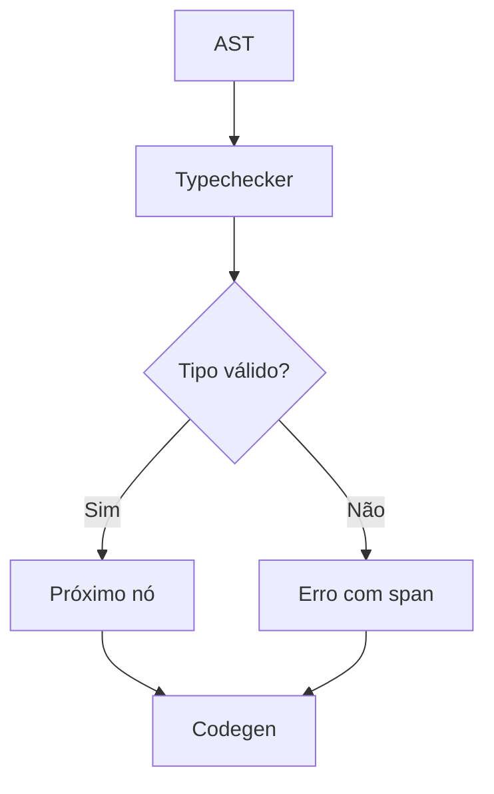

# Detalhes do Typechecker

## Objetivo
Explicar o funcionamento interno, decisões de design e algoritmos do verificador de tipos do Tupã.

## Visão Geral
O typechecker percorre a AST validando tipos, aridade, constraints e inferindo tipos quando possível. Suporta funções anônimas (lambdas), valores de função, print como built-in, strings, arrays e tipos compostos.

## Algoritmo Principal
1. Percorre a AST em pós-ordem.
2. Para cada nó:
   - Verifica tipo esperado vs. encontrado.
   - Checa aridade de funções e lambdas.
   - Propaga constraints (ex: Safe<T, !nan>).
   - Inferência de tipo para let sem anotação.
   - Diagnóstico detalhado com spans.
3. Erros são acumulados e reportados ao final.

## Exemplo de fluxo
```tupa
let f: fn(int) -> int = |x| x + 1
let y = f(10) // y: int
print("Resultado: " + y)
```
- O typechecker valida o tipo de `f`, infere o tipo de `y` e garante que `print` recebe string.

## Decisões de Design
- **Inferência local**: tipos são inferidos apenas onde não há ambiguidade.
- **Print como built-in**: simplifica diagnósticos e integração com CLI.
- **Spans detalhados**: todos os erros incluem localização precisa.
- **Extensível**: fácil adicionar novos tipos e constraints.

## Diagrama de fluxo



## Links úteis
- [Arquitetura geral](ARCHITECTURE.md)
- [Diagnósticos](DIAGNOSTICS_CHECKLIST.md)
- [SPEC: Tipos](SPEC.md#type-system)
