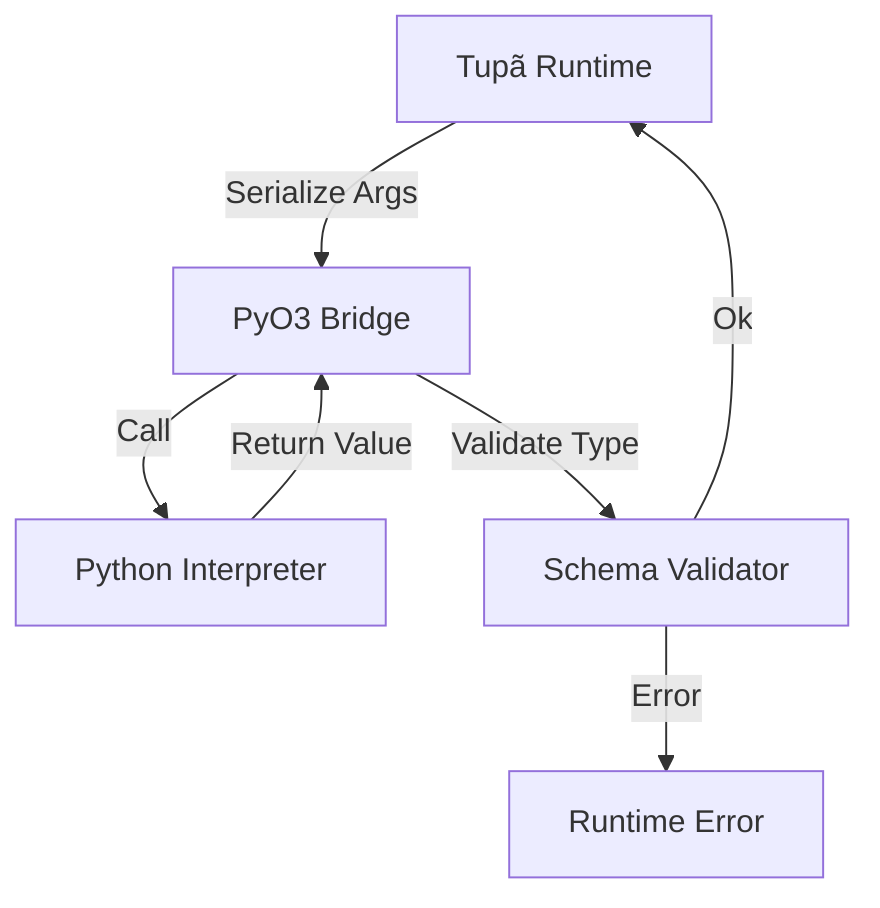

# Python FFI Contract (v0.8.0)

## 1. Controlled Call

```tupa
@external(python="torch.nn.Linear", effects=[ExternalCall("pytorch")])
fn linear_layer(input: Tensor) -> Tensor {
    // Empty body — implementation delegated to Python
}
```

### Schema Enforcement

- **Tupã Inputs** → serialized to Python via JSON/msgpack
- **Python Outputs** → validated against Tupã type before return

### Initially supported types

- `i64`, `f64`, `bool`, `string`
- `Tensor` (minimal wrapper for ndarray/PyTorch tensor)
- `Structs` simple (no generics)

### Tracked Effects

- Every Python call receives `ExternalCall("lib_name")` effect
- Propagated for determinism analysis:

```tupa
pipeline SafeInference @deterministic {
    steps: [
        step("predict") { linear_layer(input) }  // ❌ Rejected: ExternalCall in @deterministic
    ]
}
```

## 2. Crate Structure

```bash
# New crate for FFI
cargo new --lib crates/tupa-pyffi
```

```toml
# crates/tupa-pyffi/Cargo.toml
[dependencies]
pyo3 = { version = "0.21", features = ["extension-module"] }
serde = "1.0"
serde_json = "1.0"
tupa-parser = { path = "../tupa-parser" } # Replaces tupa-ast
tupa-typecheck = { path = "../tupa-typecheck" }
```

## 3. Build Contract

```toml
# Cargo.toml (root)
[workspace.metadata.tupa]
python-min-version = "3.9"
pytorch-min-version = "2.0"  # Documented, not enforced yet
```

## 4. Execution Flow


