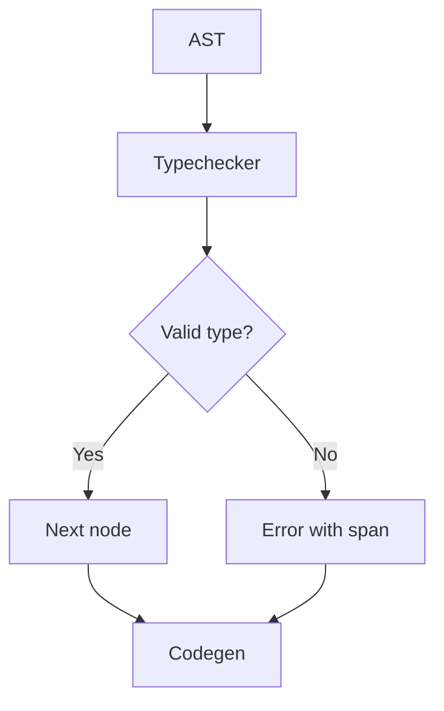

# Typechecker Details

## Purpose

This document explains internal operations, design decisions, and algorithms of the Tupã typechecker.

## Overview

The typechecker walks the AST validating types, arity, constraints, and inferring types when possible. It supports anonymous functions (lambdas), function values, print as a built-in, strings, arrays, and composite types.

## Main Algorithm

1. Traverse the AST in post-order.
2. For each node:
   - Check expected vs found type.
   - Check arity of functions and lambdas.
   - Propagate constraints (for example, Safe<f64, !nan> or Safe<string, !hate_speech>).
   - Type inference for `let` without annotation.
   - Detailed diagnostics with spans.
3. Errors are accumulated and reported at the end.

## Flow Example

```tupa
let f: fn(int) -> int = |x| x + 1
let y = f(10) // y: int
print("Result: " + y)
```

- The typechecker validates the type of `f`, infers the type of `y`, and ensures `print` receives a string.

## Design Decisions

- **Local inference**: types are inferred only where there is no ambiguity.
- **Print as a built-in**: simplifies diagnostics and CLI integration.
- **Detailed spans**: all errors include precise location.
- **Extensible**: easy to add new types and constraints.
- **Constraint model**: `f64` constraints (`!nan`, `!inf`) are proven via constants; `string` constraints (`!hate_speech`, `!misinformation`) propagate only from proven `Safe` values.

## Flow Diagram



## Useful Links

- [Architecture](../overview/architecture.md)
- [Diagnostics](diagnostics_checklist.md)
- [SPEC: Types](spec.md#type-system)
