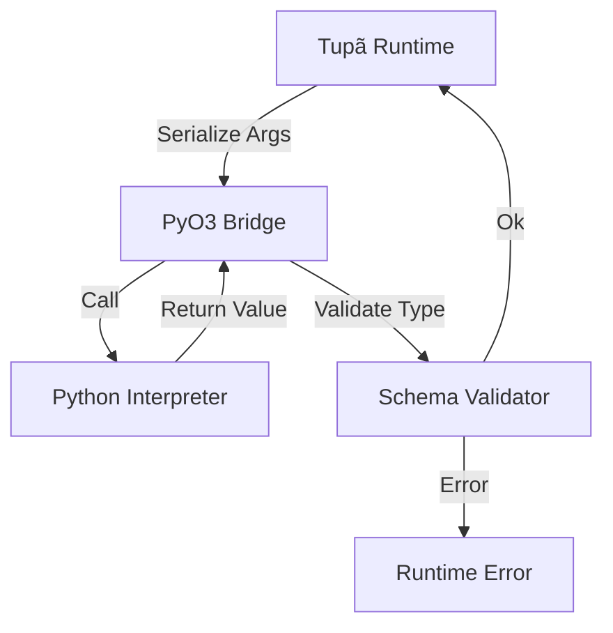

# Contrato FFI de Python (v0.8.0)

## 1. Llamada Controlada

```tupa
@external(python="torch.nn.Linear", effects=[ExternalCall("pytorch")])
fn linear_layer(input: Tensor) -> Tensor {
    // Cuerpo vacío — implementación delegada a Python
}
```

### Cumplimiento de Esquema (Schema Enforcement)
- **Inputs Tupã** → serializados a Python vía JSON/msgpack
- **Outputs Python** → validados contra tipo Tupã antes del retorno

### Tipos soportados inicialmente:
- `i64`, `f64`, `bool`, `string`
- `Tensor` (wrapper mínimo para ndarray/PyTorch tensor)
- `Structs` simples (sin genéricos)

### Efectos Rastreados
- Toda llamada a Python recibe el efecto `ExternalCall("lib_name")`
- Propagado para análisis de determinismo:

```tupa
pipeline SafeInference @deterministic {
    steps: [
        step("predict") { linear_layer(input) }  // ❌ Rechazado: ExternalCall en @deterministic
    ]
}
```

## 2. Estructura de Crates

```bash
# Nuevo crate para FFI
cargo new --lib crates/tupa-pyffi
```

```toml
# crates/tupa-pyffi/Cargo.toml
[dependencies]
pyo3 = { version = "0.21", features = ["extension-module"] }
serde = "1.0"
serde_json = "1.0"
tupa-parser = { path = "../tupa-parser" } # Reemplaza tupa-ast
tupa-typecheck = { path = "../tupa-typecheck" }
```

## 3. Contrato de Compilación

```toml
# Cargo.toml (root)
[workspace.metadata.tupa]
python-min-version = "3.9"
pytorch-min-version = "2.0"  # Documentado, no forzado aún
```

## 4. Flujo de Ejecución


