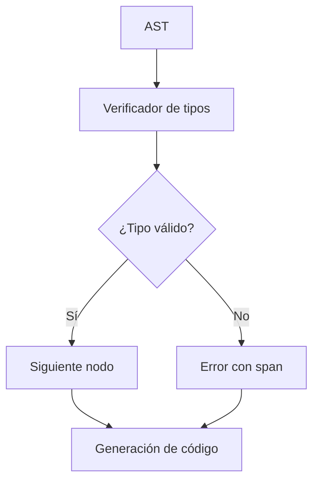

# Detalles del verificador de tipos

## Propósito

Explicar el funcionamiento interno, decisiones de diseño y algoritmos del verificador de tipos de Tupã.

## Resumen

El verificador de tipos recorre la AST validando tipos, aridad, restricciones e infiriendo tipos cuando es posible. Soporta funciones anónimas (lambdas), valores de función, print como incorporado, strings, arrays y tipos compuestos.

## Algoritmo principal

1. Recorre la AST en post-orden.
2. Para cada nodo:
   - Verifica tipo esperado vs encontrado.
   - Verifica aridad de funciones y lambdas.
   - Propaga restricciones (por ejemplo, Safe<f64, !nan> o Safe<string, !hate_speech>).
   - Inferencia de tipos para `let` sin anotación.
   - Diagnósticos detallados con spans.
3. Los errores se acumulan y se reportan al final.

## Ejemplo de flujo

```tupa
let f: fn(int) -> int = |x| x + 1
let y = f(10) // y: int
print("Resultado: " + y)
```

- El verificador de tipos valida el tipo de `f`, infiere el tipo de `y` y asegura que `print` reciba una string.

## Decisiones de diseño

- **Inferencia local**: los tipos se infieren solo donde no hay ambigüedad.
- **Print como incorporado**: simplifica diagnósticos e integración con el CLI.
- **Spans detallados**: todos los errores incluyen ubicación precisa.
- **Extensible**: fácil agregar nuevos tipos y restricciones.
- **Modelo de restricciones**: las restricciones de `f64` (`!nan`, `!inf`) se prueban vía constantes; las restricciones de `string` (`!hate_speech`, `!misinformation`) se propagan solo desde valores `Safe` comprobados.

## Diagrama de flujo



## Enlaces útiles

- [Arquitectura](../overview/architecture.md)
- [Diagnósticos](diagnostics_checklist.md)
