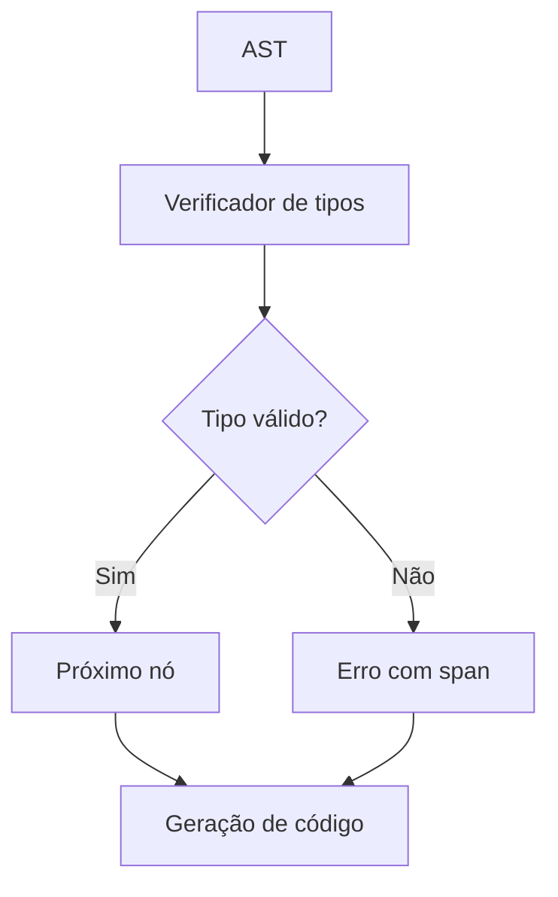

# Detalhes do verificador de tipos

## Propósito

Explicar o funcionamento interno, decisões de design e algoritmos do verificador de tipos do Tupã.

## Visão geral

O verificador de tipos percorre a AST validando tipos, aridade, restrições e inferindo tipos quando possível. Ele suporta funções anônimas (lambdas), valores de função, print como built-in, strings, arrays e tipos compostos.

## Algoritmo principal

1. Percorra a AST em pós-ordem.
2. Para cada nó:
   - Verifique tipo esperado vs encontrado.
   - Verifique aridade de funções e lambdas.
   - Propague restrições (por exemplo, Safe<f64, !nan> ou Safe<string, !hate_speech>).
   - Inferência de tipos para `let` sem anotação.
   - Diagnósticos detalhados com spans.
3. Erros são acumulados e reportados ao final.

## Exemplo de fluxo

```tupa
let f: fn(int) -> int = |x| x + 1
let y = f(10) // y: int
print("Resultado: " + y)
```

- O verificador de tipos valida o tipo de `f`, infere o tipo de `y` e garante que `print` recebe uma string.

## Decisões de design

- **Inferência local**: tipos são inferidos apenas quando não há ambiguidade.
- **Print como embutido**: simplifica diagnósticos e integração com o CLI.
- **Spans detalhados**: todos os erros incluem localização precisa.
- **Extensível**: fácil adicionar novos tipos e restrições.
- **Modelo de restrições**: restrições de `f64` (`!nan`, `!inf`) são provadas via constantes; restrições de `string` (`!hate_speech`, `!misinformation`) propagam apenas de valores `Safe` comprovados.

## Diagrama de fluxo



## Links úteis

- [Arquitetura](../overview/architecture.md)
- [Diagnósticos](diagnostics_checklist.md)
- [SPEC: Tipos](spec.md#type-system)
